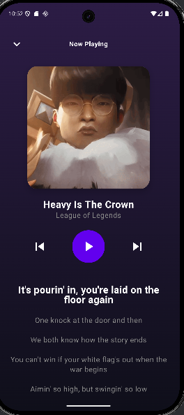
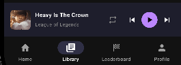
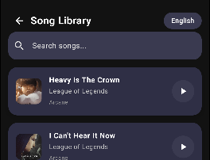

# MAD25_P03_Team03
##Disclaimer
This is a student assignment project for the Kotlin App Development module at Ngee Ann Polytechnic. Developed for educational purposes.

---------------------------
## Student Name and ID, Github Username

Liew Zhan Yang - s10259432, Github Username: LiewZhanYang

Garence Wong Kar Kang - S10262458, Github username: GarenceWong

Jayden Toh Xuan Ming - S10241868, Github username: JaydenToh

Lam Jun Yuan Leeuwin - S10256929, Github username: sleeeeepyyyyy

---------------------------

## Introduction - 🎵 MusicApp

The MusicApp is a Kotlin-based mobile application created to deliver a fun and interactive music experience. The app combines music discovery with gameplay, allowing users to test their song knowledge while exploring a curated library of tracks.

At the heart of the app is a song guessing quiz, where users identify songs through multiple–choice questions under timed conditions. A lives/heart system adds challenge and encourages replayability. Beyond the quiz, users can browse a structured Song Library, search for specific tracks, and even use a Song Identifier feature powered by an external API to look up songs.

The app also includes a Login and Signup system, enabling personalized user access. After logging in, users land on a dedicated Home Page, which acts as the main navigation hub for all features.

This project demonstrates core skills in Kotlin development, UI design, API integration, authentication handling, and mobile app architecture—resulting in a complete and engaging music-based application.

---------------------------

## 🌟 Motivation / Objective

In today’s digital environment, music applications are widely available, but most focus solely on streaming or playlist creation. Users who want to test their music knowledge, identify unknown songs, or casually learn new tracks often need to use multiple separate apps.

This results in several pain points:

Fragmented user experience — Quiz apps, song identification apps, and music browsing apps exist separately, forcing users to switch between platforms.

Lack of casual learning tools — Many music apps do not provide features that help users learn song titles, artists, or genres in an interactive way.

Limited engagement — Streaming apps prioritize passive listening, but do not offer game-like elements that increase user retention and enjoyment.

From a project perspective, this gap presents an opportunity to create a single, integrated platform that addresses these shortcomings. By combining quiz mechanics, a searchable song library, and external API–based song identification, the app delivers both entertainment and practical value.

This project also provides business value by targeting a segment of users who enjoy music-based games, trivia, and discovery tools — features proven to greatly increase engagement and session duration in entertainment apps.

---------------------------

## 📚 App Category of the App

Primary Category: Music & Audio & Entertainment

This application falls under the Music & Audio category, as it focuses on providing an interactive experience involving song quizzes, music discovery, and song identification. The app combines fun gameplay with practical tools that allow users to explore and learn about music.

---

## Current State of Deployment (Software Lifecycle)

In the **software lifecycle**, the app is currently in the **Development / Testing** stage. It is built to run quickly on your machine for debugging, not for public release.

### 1. Current Status: Development Build (Local Testing)
Right now, the app is in a development state.

- **Runs on your computer only:**  
  Android Studio builds a **debug APK** mainly for testing.
- **Not hardened for public release:**  
  Debug builds often keep settings more “open” to make development easier. This can make it easier for others to inspect how the app works.
- **May fail on other devices:**  
  Some Firebase settings may be tied to your setup (such as app identifiers). If you send the debug build to someone else, features like login may not work as expected.

### 2. What Must Change for Release (Production / Deployment)
To move into the **Deployment / Release** stage of the lifecycle (e.g., Google Play Store), three key changes are needed:

#### A. Strengthen the App (Security)
- **Now:** Code is built in a readable way to help you debug.
- **For release:** Turn on **code shrinking/obfuscation** (minification) so the app is harder to reverse-engineer or tamper with.

---

---------------------------

## Declaration of LLM Used

- Chatgpt
- Gemini
- Copilot
- Perplexity
- Mermaid AI
- Grok

---------------------------

## TechStakes

- Kotlin
- Kotlin Jetpack Compose 
- Firebase
- Supabase
  

---------------------------

## Generate Creatives Ideas using Ideation Techniques

# Brainstorming

# SCAMPER

## 1. **Music Streaming and Library Management**

- **Use Case**: Allow users to stream music from a local or cloud library, manage playlists, and organize tracks by genres, albums, or artists.
- **Features**:
    - Playlists creation and management
    - Sorting and searching music by title, artist, genre, or album
    - Support for various audio formats (MP3, FLAC, etc.)
    - Integration with third-party streaming services (Spotify, YouTube, etc.)
- **Framework Potential**: A **media player framework** that can handle audio playback, playlists, and track management. This can be extended for both offline and online music streaming.

## 2. **Personalized Music Recommendations**

- **Use Case**: Suggest personalized playlists, albums, or songs based on listening habits, preferences, and mood.
- **Features**:
    - Machine learning-based recommendation engine
    - User data tracking for preferences and listening history
    - Integration with social media or external APIs for additional insights (e.g., last.fm)
- **Framework Potential**: A **recommendation system module** that can suggest music based on user behavior. It can also be extended with additional features like mood-based playlists.

## 3. **Music Discovery and Social Sharing**

- **Use Case**: Let users discover new music, share their favorite tracks with friends, and interact with others in the music community.
- **Features**:
    - Social sharing of tracks, playlists, and albums to social networks or within the app
    - Music discovery features (e.g., trending songs, new releases)
    - Social listening features (e.g., group sessions, shared playlists)
- **Framework Potential**: A **social music discovery framework** that integrates with social media APIs and allows users to share and discover content both within and outside the app.

## 4. **Offline Playback and Music Caching**

- **Use Case**: Enable offline music playback by allowing users to download tracks, albums, or playlists.
- **Features**:
    - Download music for offline listening (requires local storage management)
    - Manage offline content (delete, reorganize)
    - Background playback when the app is minimized
- **Framework Potential**: A **music caching and offline playback module** to manage storage and ensure smooth offline experience. It could also include an intelligent system for managing space.

## 5. **Sleep and Focus Mode with Music**

- **Use Case**: Design features that help users relax or focus using music, such as sleep-inducing soundscapes or concentration playlists.
- **Features**:
    - Customizable soundscapes (e.g., rain, white noise, nature sounds)
    - Focus and productivity music playlists (e.g., lo-fi, ambient)
    - Sleep timer functionality that fades out music after a set time
- **Framework Potential**: A **sound-based relaxation framework** designed to be integrated into wellness or productivity apps, offering customized sound experiences for specific user needs.

## 6. **Collaborative Playlists and Group Listening**

- **Use Case**: Enable users to create shared playlists and listen to music together, either in real-time or asynchronously.
- **Features**:
    - Collaborative playlist creation and management
    - Real-time group listening with synchronized playback
    - Integration with social features (invite friends, share music)
- **Framework Potential**: A **group listening framework** that allows synchronized music sessions across multiple devices and supports shared playlists.
  
---

## Tasks & Featured for Each Member for Stage 1

| Name| Feature| Description | 
|------------------|------------------|------------------|
| Liew Zhan Yang | Song Guessing Game | Users listen to a short clip of a song and must guess its title; Points are awarded for correct guesses |
| Liew Zhan Yang | Home navigation | Link all pages together |
| Garence | Song Identifier | Users tap a button to let the app listen to nearby music, then it identifies the song and shows the title and artist. |
| Jayden | Song Library | Displays all songs within the firebase. Showing title, artist, album, and song. You can play the song if you click the play button. |
| Jayden | Search | The search button filters the firebase so you can look for the song you want. |
| Leeuwin | Login/SignUp | Users create accounts with a username and email, securely authenticate, and verify identity using a generated OTP before accessing the app’s main features, |

## Tasks & Features for Each Member – Stage 2

| Name | Feature | Description |
|------------------|---------------------------|--------------------------------------------------------------------------------------------------------------------------------|
| Garence Wong Kar Kang | Mood Tagging | Mood selection after a song is identified (Chill / Hype / Emotional). |
| Garence Wong Kar Kang | Identifier History | Saves identified songs into a persistent history (SharedPreferences)  | 
| Garence Wong Kar Kang |  Mood Playlist | Generates playlist suggestions based on tagged moods in history  | 
| Liew Zhan Yang | Expanded Quiz Categories | • Integrated a dynamic category selection system that allows users to switch between English and Mandarin Pop music datasets. • Leveraged Supabase to fetch language-specific song metadata and audio assets, ensuring a diverse and localized gaming experience. |
| Liew Zhan Yang | Performance Statistics | • Designed a comprehensive post-game summary screen that tracks and displays user performance metrics. • Provides detailed feedback including accuracy percentages and total points earned to help users monitor their progress over time. |
| Liew Zhan Yang | Dynamic Difficulty System | • Implemented three distinct difficulty levels—Easy, Middle, and Hard—allowing users to tailor the challenge to their skill level. • Difficulty adjustments influence game mechanics such as timer duration and the complexity of trivia questions. |
| Liew Zhan Yang | Multiplayer Waiting Room | • Developed a real-time “Lobby” system using Cloud Firestore to facilitate room discovery and matchmaking. • Users can create private rooms or join existing sessions, with live status updates (e.g., “waiting” or “playing”) synchronized across all clients. |
| Liew Zhan Yang | Multiplayer Trivia Mode | • Built a real-time PvP trivia engine where players compete head-to-head to identify songs simultaneously. • Synchronizes question indices and player scores instantly through Firestore document listeners to ensure fair and competitive play. |
| Liew Zhan Yang | Multiplayer Rhythm Mode | • Introduced a timing-based competitive mode where players must tap in synchronization with music beats. • Uses real-time data streaming to track and compare rhythm accuracy between opponents in a shared game room. |
| Liew Zhan Yang | Humming / Mimic Challenge | • Developed an innovative multiplayer mode that requires users to mimic or hum the melody of a track. • Utilizes frequency-based pitch detection logic to evaluate and score the accuracy of the user's vocal performance against the original song. |
| Liew Zhan Yang | Automated Bot System | • Engineered sophisticated AI logic modules (TriviaBotLogic and RhythmBotLogic) to provide challenging opponents for solo players. • Bots simulate human-like behavior with variable reaction times and accuracy levels based on the selected game difficulty. |
| Liew Zhan Yang | Global Leaderboard | • Implemented a centralized ranking system that displays top-performing players across the entire platform. • Fetches and sorts user data from Firebase to encourage global competition and community engagement. |
| Liew Zhan Yang | Social & Messaging System | • Built a comprehensive social ecosystem featuring a Friends System for managing connections and a real-time Chat for direct communication. • Messages are synchronized instantly using Firestore, supporting a seamless social experience within the application. |
| Liew Zhan Yang | Personalized User Profiles | • Created customizable user profiles that showcase individual achievements, player stats, and social status. • Allows users to view both their own profiles and those of other players to foster a sense of community. |
| Liew Zhan Yang | Account Security & Recovery | • Enhanced platform integrity with email-verified login and a secure “Forget Password” recovery workflow. • Integrated a dedicated Log Out function and session management to ensure user data remains protected across different devices. |
| Jayden Toh Xuan Ming | Music Profile with Media Control | • An individual profile for each music within SongLibrary that allows you to skip, repeat, pause, and play the song. |
| Jayden Toh Xuan Ming | Lyrics Syncing with Song | • This is within music profile where I synced the song that is played with the lyrics played, as it automatically highlights the part being played.   This allows you to see where the song is currently being played at so that users can mute the audio and sing to it if they wanted. |
| Jayden Toh Xuan Ming | Music Player Bar | • A persistent mini player bar at the bottom of the screen displays the current track info and artist, with quick access to play, pause, repeat and skip controls. |
| Jayden Toh Xuan Ming | Background Playing | • This relates back to the music profile features that I did, where when you have playe a song, you can close the android application and the song is still able to play. |

## System Architecture Diagram

The Presentation Layer (Frontend)
Modern UI Framework: The application is built entirely using Jetpack Compose, allowing for a reactive and modern user interface that adapts to complex game states.
Centralized Navigation: We implemented a sophisticated AppNavGraph that manages all routing, from single-player modes to real-time multiplayer lobbies and social screens.
Real-time UI Syncing: Screens like the PvpGameScreen and ChatScreen use state observers to reflect live data updates from the backend without requiring manual refreshes.

The Data Layer (Logic & Integration)
Hybrid Data Strategy: We transitioned from local data to a hybrid model where SongRepository handles static content and FirestoreService handles dynamic interactions.
Advanced Networking with Retrofit: For the Song Identification feature, we use Retrofit to handle multipart uploads, allowing the app to send raw audio samples to an external AI API for fingerprinting.
Game Engine Logic: Dedicated logic components, such as RhythmBotLogic and TriviaBotLogic, manage the "Bot Mode" to ensure a consistent experience even when playing offline or without a partner.

The Backend Layer (Cloud Infrastructure)

Google Firebase (The Social Engine):
Authentication: Manages secure user identities and email verification.
Cloud Firestore: Acts as the real-time backbone for the Friends System, Messaging, and Matchmaking, synchronizing player scores and game status across devices instantly.

Supabase (The Content Engine):
PostgreSQL Database: We leveraged Supabase to store our expanded song metadata (English and Mandarin collections), allowing us to scale our library far beyond the limits of a traditional mobile app.
External Asset Management: Supabase manages the remote URLs for all audio files, ensuring that the app stays lightweight by streaming music rather than storing it locally.

## User Interview

| **Persona 1 — Sarah Tan**                                                                                                                                                                                                                                                                                                                                                                                                         | **Persona 2 — Mark Lee**                                                                                                                                                                                                                                                                                                                                                                                                                                                  |
| ---------------------------------------------------------------------------------------------------------------------------------------------------------------------------------------------------------------------------------------------------------------------------------------------------------------------------------------------------------------------------------------------------------------------------------- | ---------------------------------------------------------------------------------------------------------------------------------------------------------------------------------------------------------------------------------------------------------------------------------------------------------------------------------------------------------------------------------------------------------------------------------------------------------------------------- |
| ** Marketing Manager · Age 38**   **Tech Comfort:** High    **Goal:** • Complete tasks as quickly as possible.    **Frustration:** • Multi-step processes  • Complex information input    **Quote:**  *"I only have 5 minutes of quiet time. If I can't finish it then, I forget about it."*    **Design Insight:** • Clear CTAs  • Pre-filled forms  • Strong mobile experience | ** University Student · Age 21**   **Tech Comfort:** Medium    **Goal:** • Find the lowest price or best value for any purchase/service.    **Frustration:** • Hidden fees  • Lack of transparency  • Complex discount codes    **Quote:**  *"I'll spend an extra 10 minutes checking three sites if it saves me $5."*    **Design Insight:** • Clear pricing comparisons  • Visible savings  • Simple expense tracking |

## 🎶 Song Guessing Game Wireframes (part 1 - version)

### Overview

These wireframes detail the core mobile user experience (UX) and interface (UI) for the "Song Guessing Game," covering key flows such as user authentication, profile management, game, score tracking, and application settings.

### Design Preview

To view the live, interactive wireframes and design annotations, use the link below:

View Full Wireframes on Figma: 
https://www.figma.com/design/Fbf0YaYMkNE8I4efAo8EwP/song-guessing-game-wireframe-version-1?t=VjOIe16cEkqFFL8z-0

---

## 🎵 Song Guessing Game – Detailed User Flows

This document outlines the end-to-end user paths within the application, focusing on steps, decision points, and potential scenarios for key features.

### **Flow 1: User Onboarding and Authentication**

#### **1.1 Sign-Up (Happy Path)**

| Step | Action | Expected Outcome | Screen/State |
|------|--------|------------------|--------------|
| 1 | User taps **“Sign Up”** | Display registration form | Sign-Up Screen |
| 2 | User enters valid Email, Username, and matching Passwords | **Sign Up** button becomes active | Sign-Up Screen |
| 3 | User taps **“Sign Up”** | Account created successfully | Profile Screen |

---

#### **Edge Cases and Alternatives**

| Scenario | Trigger | Resolution / Alternative Path |
|----------|---------|-------------------------------|
| Login Failure | Incorrect email or password | Show error **“Incorrect email or password.”** |
| Registration Exists | Email/username already used | Show **“This email or username is already taken.”** |
| Invalid Input | Invalid email/password format | Inline validation; sign-up disabled |
| Forgot Password | User taps link | Trigger email recovery |

---

### **Flow 2: Single-Player Gameplay**

#### **2.1 Game Completion (Happy Path)**

| Step | Action | Expected Outcome | Screen/State |
|------|--------|------------------|--------------|
| 1 | User reads the rules and click o start button| The game screen page should come out | GameScreen |
| 2 | User guesses correctly | next song, add score, show display is correctly  | GameScreen  |
| 3 | User finish all songs | Show score and have button choose to replay game and another button to back to rules page | GameScreen |

---

#### **Edge Cases**

| Scenario | Trigger | Resolution |
|----------|---------|------------|
| Incorrect Guess | Incorrect function | Show incorrectly with a "X" icon , continue to next question |
| Time Out | Timer reaches zero | Show a time out display, continue to next question |

---

### **Flow 3: Song Identifier**

### **3.1 Identify Song**
------------------------------

| Step | Action                                     | Expected Outcome                                                                     | Screen/State            |
|------|--------------------------------------------|--------------------------------------------------------------------------------------|-------------------------|
| 1    | User opens **Song Identifier**             | Screen shows a gradient background and a big circular button with a music note icon | Song Identifier Screen  |
| 2    | User taps the **music note** button        | App asks for microphone permission if needed, or starts getting ready to listen     | Permission Dialog / Song Identifier |
| 3    | Permission is granted                      | Button text changes to **“STOP SEARCHING”** and status shows that the app is listening | Listening State         |
| 4    | User lets a song play near the phone       | App records a short sample and then starts processing the audio                     | Processing State        |
| 5    | AudD API finds a matching song             | Screen displays the song title and artist (e.g. `Song: … / Artist: …`)              | Result Shown            |
| 6    | User taps the button again                 | App gets ready to listen for another song and repeats the process                   | Listening State         |

---

Edge Cases and Alternatives
---------------------------

| Scenario                     | Trigger / Condition                                   | Resolution / Alternative Path                                                                 |
|------------------------------|-------------------------------------------------------|-----------------------------------------------------------------------------------------------|
| Microphone Permission Denied | User taps **Deny** on the permission popup           | Show a short message: “Microphone permission required”, and keep status as “Tap the music note to start” |
| Recording Too Short / Invalid| Recording stops too early or file is empty/damaged   | Show message “Recording failed or was too short.” and ask user to tap the music note to try again       |
| No Match Found               | AudD cannot recognise the song                       | Show status “No match found please try again” so user knows to try with clearer or louder audio         |
| Network Error                | No internet connection or request fails              | Show simple error message such as “Network failure: …” and ask the user to try again later              |
| API Error (4xx / 5xx)        | AudD returns an error instead of a normal result     | Show `API error: <code>` at the bottom and reset status to “Tap the music note to start”                |
| User Stops Recording Early   | User taps the button while the app is listening      | App stops recording immediately and still tries to identify the song using the recorded audio           |

---

# User Persona

# User Problems and Opportunities

### Problem 1: Onboarding and progression feel confusing or frustrating
Many music apps force users through long sign-up flows, confusing menus, and unclear levels or rewards. New users can feel lost and give up before even playing a round.

**Opportunity for our app:**  
Keep the flow simple and direct – let users start playing or identifying songs quickly, with a clean layout and clear labels (e.g. “Play”, “Song Library”, “Song Identifier”). Progression (scores, levels, achievements) is shown in one place, not hidden behind multiple screens.

---

### Problem 2: Hard to track which songs were guessed correctly and what achievements were earned
In most quiz apps, once a round ends, the information disappears. Users can’t easily see:
- Which songs they got right
- Which ones they missed
- What achievements or rewards they have already earned

**Opportunity for our app:**  
Provide a **History / Profile / Stats** section that clearly shows:
- List of songs guessed correctly
- Rounds played and high scores
- Badges or achievements unlocked  
This helps users feel progress over time and motivates them to keep playing.

---

### Problem 3: Song libraries feel limited, repetitive, or inaccurate
Users often complain that song guessing games:
- Repeat the same tracks too often  
- Have poorly organised categories (wrong decade/genre)  
- Don’t cover enough variety for different ages or music tastes

**Opportunity for our app:**  
Design a **flexible, expandable song library**, with:
- Categories like genre, decade, language, and difficulty
- The ability to add more songs over time
- Cleaner organisation so users know what type of music they are playing with

---

### Problem 4: No single app that both identifies a song and lets you interact with it in the same place
Typical user flow today:
1. Use a song ID app (e.g. Shazam-style) to identify the song  
2. Switch to another app (Spotify/YouTube) to listen  
3. Use a separate game app if they want quizzes or challenges  

This means users keep jumping between apps just to enjoy or test themselves on one song.

**Opportunity for our app:**  
Combine **song identification + song library + guessing game** in one app:
- User can identify a song using the **Song Identifier**
- Immediately see it inside the app’s library
- Use it in a quiz/guessing mode or save it as a favourite  
This gives a smoother, all-in-one music experience.

---

### Problem 5: Song recognition isn’t always reliable
Song recognition tools sometimes:
- Fail to detect songs due to noise or low volume
- Struggle with certain audio setups
- Show generic error messages with no guidance

Users are left unsure what to do next.

**Opportunity for our app:**  
Handle recognition failures more gracefully by:
- Showing clear states: “Listening…”, “Processing…”, “No match found, please try again.”
- Allowing users to retry easily
- Still letting users play the **song guessing game** even when identification fails  
This makes the app feel more reliable and less frustrating, even when the external API cannot find a match.

---

# Competitor Analysis

### Competitor 1: SongPop
**What it does:**  
SongPop is a multiplayer music trivia game where players guess songs from short clips and themed playlists.

**Relevance to our app:**  
Shows how music quizzes use categories (genre, decade, theme) and fast rounds to keep users engaged.

**Opportunity for our app:**  
Apply a similar idea of playlists and difficulty, but keep the experience simpler and combine it with our song identifier feature.

---

### Competitor 2: Guess The Song – Music Quiz
**What it does:**  
A mobile game where users listen to a short audio clip and choose the correct song or artist from multiple-choice options.

**Relevance to our app:**  
Demonstrates that “listen then pick an answer” is easy to understand and works well for casual music games.

**Opportunity for our app:**  
Include proper tracking of correct guesses, scores, and basic achievements, not just instant “right/wrong” feedback.

---

### Competitor 3: Heardle
**What it does:**  
A daily music puzzle where users guess a song from very short snippets, with more of the song revealed after each wrong guess.

**Relevance to our app:**  
Shows the appeal of a simple daily challenge that brings users back regularly.

**Opportunity for our app:**  
Offer a challenge-style mode inspired by Heardle, but also provide free-play rounds and a music library so users can play more than once per day.

---

### Competitor 4: Shazam
**What it does:**  
A song identification app that listens to audio and shows the song title, artist, and links to play it.

**Relevance to our app:**  
Inspires our **Song Identifier** feature, where the app listens to real-world audio and tries to recognise the track.

**Opportunity for our app:**  
Instead of only showing details, allow users to interact with identified songs inside our app (e.g. add to library, use in guessing rounds).

---

### Competitor 5: Spotiguess
**What it does:**  
Spotiguess is a music quiz that connects to a user’s Spotify account and creates quizzes from their playlists and listening history.

**Relevance to our app:**  
Shows the value of quizzes built from curated or personalised song lists.

**Opportunity for our app:**  
Provide an in-app song library with categories and difficulty, without requiring external account linking, and combine this with our built-in song identifier in a single app.

---
User Testing

---

## Advanced Technical Features & Domain Implementation

### 1. Immersive Audio Engine and Media Architecture
**Feature: Music Profile with Media Control**  
Each track in the SongLibrary has its own profile view that provides full playback control.

**Core Controls**
- Play
- Pause
- Skip
- Repeat

**Technical Implementation**
- **Shared media state:**  
  Built around `ViewModel + StateFlow` so the Music Profile and Mini-Player read from the same playback state. This keeps UI consistent across screens without tightly coupling components.
- **Smooth performance with coroutines:**  
  Used Kotlin Coroutines to run media preparation and buffering off the main thread, preventing UI lag when loading audio.

---

### 2. Algorithmic Lyric Synchronization (New Domain)
**Feature: Real-Time Lyrics Syncing**  
Lyrics move in sync with the current audio playback to support karaoke and guided practice.

**How it works**
- The app tracks the current playback time and highlights the lyric line being sung.
- Users can follow along visually for practice and sing-along.

**Technical Implementation**
- **Custom lyric syncing engine:**  
  Parses LRC lyrics into timed lines, then maps the media player’s current timestamp to the correct lyric line.
- **Efficient line lookup:**  
  Uses fast searching (e.g., binary search or optimized scanning) to quickly find the active line without heavy CPU usage.
- **Compose redraw optimization:**  
  Updates only the active lyric line instead of re-rendering the entire lyrics list, helping maintain smooth animations and stable frame rates.

---

### 3. Background Playback and Service Lifecycle
**Feature: Mini-Player Bar and Background Playing**  
A persistent mini-player and background audio service allow music to continue even when the app is minimized, closed, or the phone is locked.

**Technical Implementation**
- **Foreground Service for reliability:**  
  Implemented a Foreground Service with a persistent notification to reduce the chances of Android stopping the audio process in the background.
- **MediaSession integration:**  
  Supports headset and lock screen media controls, and correctly handles audio focus events (e.g., pausing for incoming calls).
- **Robust lifecycle handling:**  
  Designed the UI-to-service connection to handle configuration changes (such as screen rotation) and activity recreation without breaking playback.

---

# App Features 

---

### Music Profile with Media Control
An individual profile view for each track within the SongLibrary that grants users full playback control.

- Dedicated controls available directly in the profile:
  - Play
  - Pause
  - Skip
  - Repeat

### Lyrics Syncing with Song
Lyrics are synchronized with the currently playing audio to support karaoke and guided practice.

- Real-Time Synchronization  
  The app syncs audio with lyrics and automatically highlights the line currently being sung.

- Karaoke/Practice Mode  
  The visual highlight helps users follow the exact song position, enabling sing-along practice.

### Music Player Bar
A persistent mini-player that stays visible while users navigate through different screens.

- Persistent Mini-Player  
  A sticky player bar at the bottom of the screen remains accessible across the app.

- Quick Access  
  Displays current track information (Title/Artist) and provides immediate access to:
  - Play
  - Pause
  - Repeat
  - Skip  
  without requiring users to open the full music profile.

### Background Playing
Music continues playing seamlessly even when the app is not in the foreground.

- Seamless Audio Service  
  A background service allows playback to continue uninterrupted when the Android application is minimized or closed.

- Continuous Listening  
  Integrates with the music profile workflow so playback is not cut off when users switch apps or lock their phone.

### Switch between language in Song LIbrary
Button to toggle the language of the song. 

---

## Design Decisions & Philosophy

### 1. The "Immersive Dark" Aesthetic
**Decision:** Adopted a unified high-contrast dark theme (Background `#121212`) across the entire application, replacing earlier iterations that used light modes or gradient backgrounds.

**Rationale:**
- **Gamer-centric focus:** Dark interfaces reduce eye strain during long sessions and keep attention on core content such as album art, lyrics, and game prompts instead of UI chrome.
- **OLED optimization:** A near-black palette (`#121212`) can be more power-efficient on modern displays, which matters for mobile use with continuous audio and animations.
- **Visual consistency:** Earlier versions had inconsistent theme usage across screens (e.g., light profile vs. dark game). Unifying the theme removed jarring transitions and created a seamless flow from login to gameplay.

---

### 2. Surface Level Hierarchy vs. Borders
**Decision:** Used surface colors (e.g., Dark Purple/Blue `#2F2F45`) to create hierarchy and separation, instead of relying on white outlines or heavy borders.

**Rationale:**
- **Reduced visual noise:** Borders can add clutter and make layouts feel unfinished. Tonal surfaces create depth and separation without additional lines.
- **Modern UI alignment:** This follows Material Design 3 conventions where elevation and tonal contrast are preferred over strokes to define components.

---

### 3. Functional Color Coding 
**Decision:** Reserved the primary brand color (Vibrant Purple `#651FFF`) for interactive elements (buttons, active states), and used semantic colors to communicate game status.

**Rationale:**
- **Instant feedback:** Players can understand state changes quickly without reading labels, which is critical in timed modes (e.g., 8-second rounds).
- **Consistent semantics:**
  - Green: Accuracy and correct answers
  - Orange: Streak or momentum indicators
  - Red: Failure states such as "Game Over" or "Time's Up"
- **Why not only text:** Color is processed faster than text, enabling quicker reactions under time pressure.

---

### 4. Persistent Navigation & Media Control
**Decision:** Implemented a sticky bottom media bar that persists across navigation, instead of forcing users into a dedicated full-screen "Now Playing" view.

**Rationale:**
- **Supports multi-tasking:** Users can browse leaderboard, view friends, or navigate other pages while continuing playback.
- **Frictionless flow:** One-tap controls (pause/skip) are always available, treating audio control as a core feature rather than a secondary screen.

---

## User Guide & Walkthrough

### 1. Account Access & Security
When you launch the app, you will start at the Authentication Gateway.

**Sign Up (New Users)**
1. Enter a valid email address and a strong password.
2. Tap **Sign Up** to create your account.

**Email Verification**
1. After signing up, check your email inbox for a verification link.
2. Once verified, your profile will display a **Verified Account** badge.

**Login (Returning Users)**
1. Enter your email and password.
2. Tap **Login** to access the main menu.

**Forgot Password**
- Tap **Forgot Password** on the login screen to receive a password recovery email.

---

### 2. Navigating the Home Hub
After logging in, you will land on the Home Dashboard, which acts as the central hub.

**Choose Your Adventure**
- Guessing Game (core trivia mode)
- Humming Challenge (pitch and melody challenge)
- Song Identifier (identify music utility)
- Multiplayer Lobby (real-time play with friends)

**Navigation Bar**
Use the bottom navigation bar to switch between:
- Home
- Library
- Leaderboard
- Profile  
without losing your place.

---

### 3. Playing the Song Guessing Game
Follow these steps to start and complete a game session.

**Step 1: Select Language**
After selecting **Guessing Game**, choose a song dataset:
- English
- Mandarin

**Step 2: The Game Loop**
1. **Listen:** A song clip plays automatically.
2. **Guess:** Select the correct track from the options provided.
3. **Monitor Status:** Track your remaining lives and the countdown timer during the round.

**Step 3: Game Over and Analysis**
When the session ends (no lives remaining or questions completed), the Game Over screen appears.

**Review Performance**
- Final Score
- Accuracy Percentage
- Best Streak
- Average Speed

**Next Actions**
- Play Again
- Return to Menu

---

### 4. Music Library & Listening Experience
Navigate to the **Library** tab to browse and play songs.

**Music Profile Control**
- Tap a song to open its dedicated music profile.
- Use the profile controls to:
  - Play
  - Pause
  - Skip
  - Repeat

**Karaoke Mode (Lyrics Sync)**
- Lyrics scroll in real-time and highlight the current line as the song plays.
- This can be used for practice and sing-along.

**Background Playback**
- Music continues playing even when the app is minimized or the screen is locked.

**Mini-Player Bar**
- A persistent player bar remains visible while navigating.
- Allows quick control while browsing other sections (e.g., leaderboard or profile).

---

### 5. Social & Profile Management
Use the **Leaderboard** and **Profile** tabs to personalize your account and track progress.

**Leaderboard**
- View the top players and compare your score against others.

**My Profile**
- Manage your account details and status.

**Edit Details**
- Update your username
- Update your bio / about me
- Tap **Save** to apply changes

**Account Status**
- Your profile shows whether your account is verified.

**Friends**
- View your connections using the **My Friends** counter.

**Security Tools**
- You can trigger **Send Password Reset Link** from the profile screen if needed.

---

### 6. Competitive Gameplay & Leaderboards
Your performance in the Guessing Game contributes to your standing on the leaderboard.

**Earning Points**
- Correct answers earn points.
- Faster answers, higher accuracy, and stronger streaks increase your final score.

**Climbing the Ranks**
- High scores are automatically synced to the cloud.
- The leaderboard updates to reflect current top scores and rankings.

---

### 7. Multiplayer & Social Hub
Multiplayer mode allows you to challenge friends in real time.

**Managing Friends**
- Go to **Profile** to view and manage your friends list.
- The leaderboard indicates which players are in your friend list for easier comparison.

**Starting a Multiplayer Match**
1. From the Home Dashboard, select **Multiplayer Lobby**.
2. Invite friends from your list into a live lobby.
3. Both players receive the same song prompts.
4. Points are awarded based on correct and timely guesses.

---

